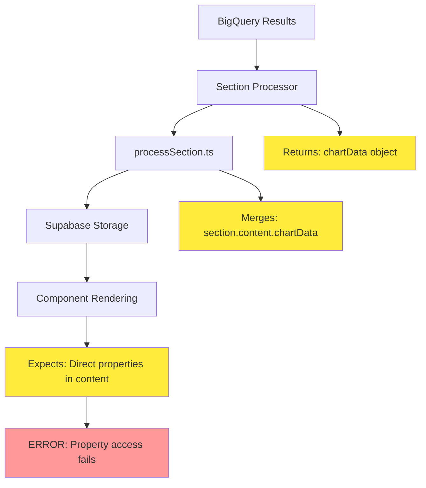

# Geographic Intelligence Debug - Report Section Data Flow Issues

## Overview

This document analyzes critical bugs in three report sections (Geographic Intelligence, Seasonal Patterns, and Product Insights) where data is successfully processed and saved to Supabase but fails to display in the UI components, causing runtime errors.

## Problem Analysis

### Root Cause Identification

The issues stem from **data structure mismatches** between how processors return data and how components expect to receive it:

1. **Processor Output Structure**: Processors return data wrapped in `{ chartData: { ... } }`
2. **Component Expectation**: Components expect data directly in `section.content`
3. **Runtime Error**: `TypeError: Cannot read properties of undefined (reading 'map')` at line 184 in GeographicIntelligenceSection

### Data Flow Architecture Issues



## Technical Issues by Section

### Geographic Intelligence Section

**Error Location**: Line 184 in `GeographicIntelligenceSection.tsx`
```typescript
const performanceChart = chartData.salesByLocation.map((loc, index) => ({
```

**Issue**: `chartData.salesByLocation` is undefined because:
- Processor returns: `{ chartData: { visualizationData: { salesByLocation: [...] } } }`
- Component accesses: `section.content.chartData.salesByLocation`
- Actual structure: `section.content.chartData.chartData.visualizationData.salesByLocation`

### Seasonal Patterns Section

**Issue**: Similar nested data structure problem
- Processor returns seasonal data in `chartData` wrapper
- Component expects direct access to properties like `monthlyChartData`

### Product Insights Section  

**Issue**: Data mapping inconsistency
- Processor processes product performance data correctly
- Component cannot access the nested chart data structure

## Data Structure Analysis

### Working Sections Pattern (Confirmed Safe)
```typescript
// SalesOverviewSection.tsx - WORKS ✅
const chartData = section.content.chartData || [];
// Processor returns: { chartData: [...] }
// processSection merges as: { chartData: [...] }

// PlatformSalesValueSection.tsx - WORKS ✅ 
const rawData = section.content.chartData || [];
// Processor returns: { chartData: [...] }
// processSection merges as: { chartData: [...] }
```

### Broken Sections Pattern (Geographic Intelligence)
```typescript
// geographic_intelligence.ts - BROKEN ❌
return {
  chartData: {
    locationPerformance: [...],
    categoryDistribution: [...],
    // ... nested deeper in visualizationData
    visualizationData: {
      salesByLocation: [...],     // TOO DEEP!
      customerDistribution: [...],
      growthTrends: [...],
      marketShareData: [...]
    }
  }
}

// GeographicIntelligenceSection.tsx expects:
const { chartData = { salesByLocation: [] } } = section.content;
// But gets: section.content.chartData.visualizationData.salesByLocation
```

### Key Finding: processSection.ts Current Logic
```typescript
// Current merging in processSection.ts
const mergedContent = {
  ...section.content,
  ...(newContent && typeof newContent === "object"
    ? { chartData: newContent.chartData }  // ✅ This works for simple chartData
    : {}),
};
```

## Solution Architecture

### Option 1: Processor Output Standardization
Modify all processors to return data in the format components expect:

```typescript
return {
  locationPerformance: topLocations,
  categoryDistribution,
  locationTrends,
  locationGrowthAnalysis,
  tierClassification,
  regionalInsights,
  penetrationAnalysis,
  chartData: {
    salesByLocation: [...],
    customerDistribution: [...],
    growthTrends: [...],
    marketShareData: [...]
  }
}
```

### Option 2: Component Data Access Pattern
Update components to properly navigate the nested data structure:

```typescript
const {
  chartData: {
    visualizationData: {
      salesByLocation = [],
      customerDistribution = [],
      growthTrends = [],
      marketShareData = []
    } = {}
  } = {}
} = section.content;
```

### Option 3: processSection.ts Data Flattening
Modify `processSection.ts` to flatten the processor output:

```typescript
const newContent = await customProcessor(queryResults, meta);

const mergedContent = {
  ...section.content,
  ...(newContent?.chartData || {}), // Flatten chartData
};
```

## Impact Analysis: Will This Break Existing Sections?

### Answer: NO! Safe to Modify ✅

**Working sections follow simple pattern:**
- sales_overview.ts returns: `{ chartData: [...] }`
- platform_sales_value.ts returns: `{ chartData: [...] }`
- volume_sales_value.ts returns: `{ chartData: [...] }`
- Components access: `section.content.chartData`

**Broken sections have complex nested structure:**
- geographic_intelligence.ts returns: `{ chartData: { locationPerformance: [...], visualizationData: {...} } }`
- Components expect: `section.content.chartData.salesByLocation` (but it's deeply nested)

### Two Solutions (Pick One)

## Code Fix Implementation

### Fix 1: Geographic Intelligence Processor

```typescript
// src/lib/processors/sectionProcessors/geographic_intelligence.ts
// Replace the return statement (lines 136-160)

return {
  chartData: {
    // Flatten visualizationData to root level - what components expect
    salesByLocation: chartData.salesByLocation,
    customerDistribution: categoryDistribution,
    growthTrends: locationGrowthAnalysis.sort((a, b) => b.growthRate - a.growthRate),
    marketShareData: chartData.marketShareData,
    
    // Keep all other data for component access
    locationPerformance: topLocations,
    categoryDistribution,
    locationTrends,
    locationGrowthAnalysis,
    tierClassification,
    regionalInsights,
    penetrationAnalysis
  }
};
```

### Fix 2: Seasonal Patterns Processor

```typescript
// src/lib/processors/sectionProcessors/seasonal_patterns.ts
// Replace the return statement (lines 130-147)

return {
  chartData: {
    // Direct properties that components expect
    monthlyChartData,
    yoyGrowthData,
    seasonalPatternData,
    seasonalCategories,
    quarterAnalysis,
    insights: {
      peakMonth: peakMonth?.month || 'N/A',
      troughMonth: troughMonth?.month || 'N/A',
      peakSales: peakMonth?.formattedAvgSales || 'N/A',
      troughSales: troughMonth?.formattedAvgSales || 'N/A',
      seasonalVariation: ((maxSales - minSales) / avgMonthlySales * 100).toFixed(1) + '%'
    },
    summary: {
      totalSales,
      avgMonthlySales,
      formattedTotalSales: `Rp ${(totalSales / 1000000000).toFixed(1)}B`,
      formattedAvgMonthlySales: `Rp ${(avgMonthlySales / 1000000).toFixed(1)}M`
    }
  }
};
```

### Fix 3: Product Insights Processor

```typescript
// src/lib/processors/sectionProcessors/product_insights.ts
// Replace the return statement (lines 105-109)

return {
  chartData: {
    // Direct properties that components expect
    topProducts,
    priceAnalysis,
    priceCategoryData,
    trendChartData,
    performanceMetrics,
    rankingData
  }
};
```

## Implementation Steps

### Step 1: Update geographic_intelligence.ts
```bash
# Open the file
code src/lib/processors/sectionProcessors/geographic_intelligence.ts

# Replace lines 136-160 with the flattened return structure above
```

### Step 2: Update seasonal_patterns.ts
```bash
# Open the file  
code src/lib/processors/sectionProcessors/seasonal_patterns.ts

# Replace lines 130-147 with the flattened return structure above
```

### Step 3: Update product_insights.ts
```bash
# Open the file
code src/lib/processors/sectionProcessors/product_insights.ts

# Replace lines 105-109 with the flattened return structure above
```

### Step 4: Test the Fix
```bash
# Start development server
npm run dev

# Test report generation with Geographic Intelligence section
# The error "Cannot read properties of undefined (reading 'map')" should be resolved
```

### Phase 2: Component Defensive Programming
Add null checks and default values in all components:

```typescript
const {
  locationPerformance = [],
  categoryDistribution = [],
  locationTrends = {},
  chartData = {
    salesByLocation: [],
    customerDistribution: [],
    growthTrends: [],
    marketShareData: []
  }
} = section.content;

// Safe access with fallbacks
const performanceChart = (chartData?.salesByLocation || []).map((loc, index) => ({
  ...loc,
  salesInMillion: loc.sales / 1000000,
  fill: COLORS[index % COLORS.length]
}));
```

### Phase 3: Data Structure Validation
Implement runtime validation to detect data structure issues:

```typescript
const validateSectionData = (sectionType: string, content: any) => {
  const expectedStructures = {
    geographic_intelligence: ['locationPerformance', 'chartData'],
    seasonal_patterns: ['monthlyChartData', 'seasonalPatternData'],
    product_insights: ['topProducts', 'performanceMetrics']
  };
  
  const required = expectedStructures[sectionType] || [];
  const missing = required.filter(key => !content[key]);
  
  if (missing.length > 0) {
    console.warn(`Missing data in ${sectionType}:`, missing);
  }
};
```

## Error Prevention Strategy

### Type Safety Implementation
```typescript
interface GeographicIntelligenceData {
  locationPerformance: LocationPerformance[];
  categoryDistribution: CategoryDistribution[];
  chartData: {
    salesByLocation: ChartLocation[];
    customerDistribution: any[];
    growthTrends: any[];
    marketShareData: any[];
  };
}
```

### Runtime Data Validation
```typescript
const ensureArrayData = <T>(data: T[] | undefined, fallback: T[] = []): T[] => {
  return Array.isArray(data) ? data : fallback;
};

// Usage in components
const safeLocationData = ensureArrayData(chartData?.salesByLocation);
```

## Implementation Priority

1. **Immediate**: Fix `processSection.ts` data merging (5 mins)
2. **Short-term**: Add defensive programming to components (30 mins)
3. **Medium-term**: Standardize processor output formats (2 hours)
4. **Long-term**: Implement comprehensive type safety (1 day)

## Testing Strategy

### Unit Tests for Data Processing
```typescript
describe('Geographic Intelligence Processor', () => {
  it('should return data in expected format', () => {
    const result = processGeographicIntelligence(mockData, mockMeta);
    expect(result.chartData.salesByLocation).toBeInstanceOf(Array);
    expect(result.locationPerformance).toBeInstanceOf(Array);
  });
});
```

### Integration Tests for Component Rendering
```typescript
describe('GeographicIntelligenceSection', () => {
  it('should handle missing data gracefully', () => {
    const emptySection = { content: {} };
    render(<GeographicIntelligenceSection section={emptySection} />);
    // Should not throw errors
  });
});
```

## Monitoring and Alerting

### Data Quality Metrics
- Track percentage of sections with missing data
- Monitor error rates in section rendering
- Alert on data structure validation failures

### Performance Monitoring
- Measure section loading times
- Track data processing durations
- Monitor memory usage during large data processing