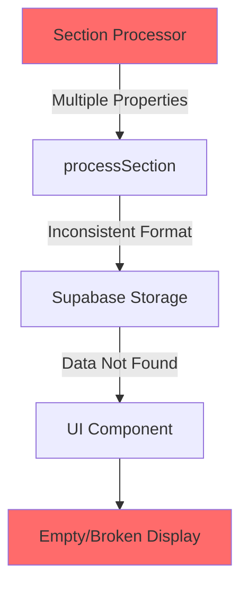
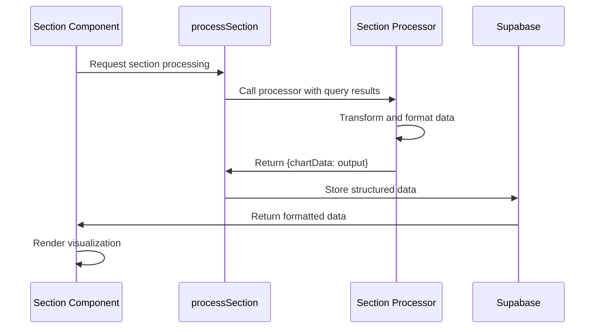
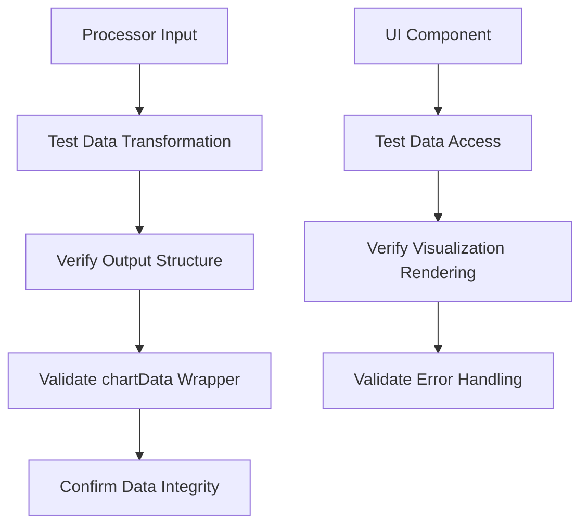

# Performance Sections Data Flow Repair

## Overview

This document outlines the implementation to fix the remaining 4 report section processors that have data persistence and display issues. Following the successful fix for customer performance section, we need to standardize the data output format for geographic intelligence, payment terms, product insights, and seasonal patterns sections.

## Technology Stack & Dependencies

### Frontend Framework
- **React 18.3.1** with TypeScript for component architecture
- **Tailwind CSS 3.4.1** for styling framework

### Data Processing
- **BigQuery Integration** for data source queries
- **Supabase** for report data persistence

### Build Tools
- **Vite 5.4.2** as build tool and development server
- **TypeScript 5.5.3** for type safety

## Architecture

The report section processing system follows a standardized data flow pattern where each processor must return data wrapped in a `chartData` object to ensure proper integration with the persistence layer and UI components.

### Current Data Flow Issue



### Required Data Flow Pattern

```mermaid
graph TD
    A[Section Processor] -->|{chartData: output}| B[processSection]
    B -->|Standardized Format| C[Supabase Storage]
    C -->|Proper Data Structure| D[UI Component]
    D --> E[Correct Display]
    
    style A fill:#51cf66
    style E fill:#51cf66
```

## Component Architecture

### Affected Section Processors

| Section | File | Current Issue | Required Fix |
|---------|------|---------------|--------------|
| Geographic Intelligence | `geographic_intelligence.ts` | Returns multiple properties | Wrap all data in `chartData` |
| Payment Terms | `payment_terms.ts` | Nested `chartData` structure | Flatten to single `chartData` wrapper |
| Product Insights | `product_insights.ts` | Returns multiple properties | Wrap all data in `chartData` |
| Seasonal Patterns | `seasonal_patterns.ts` | Returns multiple properties | Wrap all data in `chartData` |

### Data Structure Transformation

#### Geographic Intelligence Section

**Current Output Structure:**
```typescript
return {
  locationPerformance: topLocations,
  categoryDistribution,
  locationTrends,
  locationGrowthAnalysis,
  tierClassification,
  regionalInsights,
  penetrationAnalysis,
  chartData: {...}  // Nested chartData
};
```

**Required Output Structure:**
```typescript
return {
  chartData: {
    locationPerformance: topLocations,
    categoryDistribution,
    locationTrends,
    locationGrowthAnalysis,
    tierClassification,
    regionalInsights,
    penetrationAnalysis,
    visualizationData: {...}  // Renamed from chartData
  }
};
```

#### Payment Terms Section

**Current Output Structure:**
```typescript
return {
  termsOverview,
  termsDistribution,
  preferenceAnalysis,
  trendAnalysis,
  impactAnalysis,
  paymentMetrics,
  chartData: {
    distributionData: [...],
    preferencesData: [...],
    trendsData: {...}
  }
};
```

**Required Output Structure:**
```typescript
return {
  chartData: {
    termsOverview,
    termsDistribution,
    preferenceAnalysis,
    trendAnalysis,
    impactAnalysis,
    paymentMetrics,
    visualizationData: {
      distributionData: [...],
      preferencesData: [...],
      trendsData: {...}
    }
  }
};
```

#### Product Insights Section

**Current Output Structure:**
```typescript
return {
  topProducts,
  priceAnalysis,
  priceCategoryData,
  trendChartData,
  performanceMetrics,
  rankingData
};
```

**Required Output Structure:**
```typescript
return {
  chartData: {
    topProducts,
    priceAnalysis,
    priceCategoryData,
    trendChartData,
    performanceMetrics,
    rankingData
  }
};
```

#### Seasonal Patterns Section

**Current Output Structure:**
```typescript
return {
  monthlyChartData,
  yoyGrowthData,
  seasonalPatternData,
  seasonalCategories,
  quarterAnalysis,
  insights: {...},
  summary: {...}
};
```

**Required Output Structure:**
```typescript
return {
  chartData: {
    monthlyChartData,
    yoyGrowthData,
    seasonalPatternData,
    seasonalCategories,
    quarterAnalysis,
    insights: {...},
    summary: {...}
  }
};
```

## Data Flow & Integration

### Section Processing Pipeline



### Data Persistence Integration

The standardized `chartData` wrapper ensures:

1. **Consistent Storage Format**: All section data follows the same structure in Supabase
2. **Reliable Data Retrieval**: UI components can predictably access section data
3. **Type Safety**: TypeScript interfaces remain consistent across sections
4. **Error Prevention**: Eliminates undefined data access patterns

## Business Logic Layer

### Section Processor Standardization Pattern

Each processor must implement the following pattern:

```typescript
export default function processSectionName(results: any, meta: unknown) {
  // Data processing logic...
  const processedData = transformData(results);
  
  // Wrap all output in chartData
  return {
    chartData: processedData
  };
}
```

### Data Transformation Rules

1. **Preserve All Data**: No data loss during transformation
2. **Maintain Structure**: Keep existing data relationships intact  
3. **Consistent Naming**: Use descriptive property names
4. **Type Preservation**: Maintain TypeScript type definitions

## API Endpoints Reference

### Query Processing Flow

```mermaid
graph LR
    A[BigQuery] --> B[Raw Results]
    B --> C[Section Processor]
    C --> D[Formatted Data]
    D --> E[{chartData: output}]
    E --> F[Supabase Storage]
    F --> G[UI Display]
```

### Data Schema Evolution

Each section processor transformation maintains backward compatibility while standardizing the output format:

- **Input**: Raw BigQuery results from existing queries
- **Processing**: Existing business logic for data transformation
- **Output**: Standardized `{chartData: processedData}` format

## Testing Strategy

### Unit Testing Approach



### Test Cases for Each Section

1. **Data Structure Validation**
   - Verify `chartData` wrapper exists
   - Confirm all original data properties are preserved
   - Validate nested data relationships

2. **Integration Testing**
   - Test with actual BigQuery results
   - Verify Supabase storage compatibility
   - Confirm UI component data access

3. **Error Handling**
   - Test with malformed input data
   - Verify graceful degradation
   - Confirm error logging preservation**Current Output Structure:**
```typescript
return {
  locationPerformance: topLocations,
  categoryDistribution,
  locationTrends,
  locationGrowthAnalysis,
  tierClassification,
  regionalInsights,
  penetrationAnalysis,
  chartData: {...}  // Nested chartData
};
```

**Required Output Structure:**
```typescript
return {
  chartData: {
    locationPerformance: topLocations,
    categoryDistribution,
    locationTrends,
    locationGrowthAnalysis,
    tierClassification,
    regionalInsights,
    penetrationAnalysis,
    visualizationData: {...}  // Renamed from chartData
  }
};
```

#### Payment Terms Section

**Current Output Structure:**
```typescript
return {
  termsOverview,
  termsDistribution,
  preferenceAnalysis,
  trendAnalysis,
  impactAnalysis,
  paymentMetrics,
  chartData: {
    distributionData: [...],
    preferencesData: [...],
    trendsData: {...}
  }
};
```

**Required Output Structure:**
```typescript
return {
  chartData: {
    termsOverview,
    termsDistribution,
    preferenceAnalysis,
    trendAnalysis,
    impactAnalysis,
    paymentMetrics,
    visualizationData: {
      distributionData: [...],
      preferencesData: [...],
      trendsData: {...}
    }
  }
};
```

#### Product Insights Section

**Current Output Structure:**
```typescript
return {
  topProducts,
  priceAnalysis,
  priceCategoryData,
  trendChartData,
  performanceMetrics,
  rankingData
};
```

**Required Output Structure:**
```typescript
return {
  chartData: {
    topProducts,
    priceAnalysis,
    priceCategoryData,
    trendChartData,
    performanceMetrics,
    rankingData
  }
};
```

#### Seasonal Patterns Section

**Current Output Structure:**
```typescript
return {
  monthlyChartData,
  yoyGrowthData,
  seasonalPatternData,
  seasonalCategories,
  quarterAnalysis,
  insights: {...},
  summary: {...}
};
```

**Required Output Structure:**
```typescript
return {
  chartData: {
    monthlyChartData,
    yoyGrowthData,
    seasonalPatternData,
    seasonalCategories,
    quarterAnalysis,
    insights: {...},
    summary: {...}
  }
};
```

## Data Flow & Integration

### Section Processing Pipeline


### Data Persistence Integration

The standardized `chartData` wrapper ensures:

1. **Consistent Storage Format**: All section data follows the same structure in Supabase
2. **Reliable Data Retrieval**: UI components can predictably access section data
3. **Type Safety**: TypeScript interfaces remain consistent across sections
4. **Error Prevention**: Eliminates undefined data access patterns

## Business Logic Layer

### Section Processor Standardization Pattern

Each processor must implement the following pattern:

```typescript
export default function processSectionName(results: any, meta: unknown) {
  // Data processing logic...
  const processedData = transformData(results);
  
  // Wrap all output in chartData
  return {
    chartData: processedData
  };
}
```

### Data Transformation Rules

1. **Preserve All Data**: No data loss during transformation
2. **Maintain Structure**: Keep existing data relationships intact  
3. **Consistent Naming**: Use descriptive property names
4. **Type Preservation**: Maintain TypeScript type definitions

## API Endpoints Reference

### Query Processing Flow

```mermaid
graph LR
    A[BigQuery] --> B[Raw Results]
    B --> C[Section Processor]
    C --> D[Formatted Data]
    D --> E[{chartData: output}]
    E --> F[Supabase Storage]
    F --> G[UI Display]
```

### Data Schema Evolution

Each section processor transformation maintains backward compatibility while standardizing the output format:

- **Input**: Raw BigQuery results from existing queries
- **Processing**: Existing business logic for data transformation
- **Output**: Standardized `{chartData: processedData}` format

## Implementation Details

### Geographic Intelligence Processor Fix

**File**: `src/lib/processors/sectionProcessors/geographic_intelligence.ts`

**Current Return Statement:**
```typescript
return {
  locationPerformance: topLocations,
  categoryDistribution,
  locationTrends,
  locationGrowthAnalysis,
  tierClassification,
  regionalInsights,
  penetrationAnalysis,
  chartData
};
```

**Updated Return Statement:**
```typescript
return {
  chartData: {
    locationPerformance: topLocations,
    categoryDistribution,
    locationTrends,
    locationGrowthAnalysis,
    tierClassification,
    regionalInsights,
    penetrationAnalysis,
    visualizationData: chartData
  }
};
```

### Payment Terms Processor Fix

**File**: `src/lib/processors/sectionProcessors/payment_terms.ts`

**Current Return Statement:**
```typescript
return {
  termsOverview,
  termsDistribution,
  preferenceAnalysis,
  trendAnalysis,
  impactAnalysis,
  paymentMetrics,
  chartData: {
    distributionData: termsDistribution.map(term => ({
      term: term.paymentTerm,
      sales: term.totalSales,
      percentage: parseFloat(term.salesShare.toFixed(1))
    })),
    preferencesData: preferenceAnalysis,
    trendsData: trendAnalysis
  }
};
```

**Updated Return Statement:**
```typescript
return {
  chartData: {
    termsOverview,
    termsDistribution,
    preferenceAnalysis,
    trendAnalysis,
    impactAnalysis,
    paymentMetrics,
    visualizationData: {
      distributionData: termsDistribution.map(term => ({
        term: term.paymentTerm,
        sales: term.totalSales,
        percentage: parseFloat(term.salesShare.toFixed(1))
      })),
      preferencesData: preferenceAnalysis,
      trendsData: trendAnalysis
    }
  }
};
```

### Product Insights Processor Fix

**File**: `src/lib/processors/sectionProcessors/product_insights.ts`

**Current Return Statement:**
```typescript
return {
  topProducts,
  priceAnalysis,
  priceCategoryData,
  trendChartData,
  performanceMetrics,
  rankingData
};
```

**Updated Return Statement:**
```typescript
return {
  chartData: {
    topProducts,
    priceAnalysis,
    priceCategoryData,
    trendChartData,
    performanceMetrics,
    rankingData
  }
};
```

### Seasonal Patterns Processor Fix

**File**: `src/lib/processors/sectionProcessors/seasonal_patterns.ts`

**Current Return Statement:**
```typescript
return {
  monthlyChartData,
  yoyGrowthData,
  seasonalPatternData,
  seasonalCategories,
  quarterAnalysis,
  insights: {
    peakMonth: peakMonth?.month || 'N/A',
    troughMonth: troughMonth?.month || 'N/A',
    peakSales: peakMonth?.formattedAvgSales || 'N/A',
    troughSales: troughMonth?.formattedAvgSales || 'N/A',
    seasonalVariation: ((maxSales - minSales) / avgMonthlySales * 100).toFixed(1) + '%'
  },
  summary: {
    totalSales,
    avgMonthlySales,
    formattedTotalSales: `Rp ${(totalSales / 1000000000).toFixed(1)}B`,
    formattedAvgMonthlySales: `Rp ${(avgMonthlySales / 1000000).toFixed(1)}M`
  }
};
```

**Updated Return Statement:**
```typescript
return {
  chartData: {
    monthlyChartData,
    yoyGrowthData,
    seasonalPatternData,
    seasonalCategories,
    quarterAnalysis,
    insights: {
      peakMonth: peakMonth?.month || 'N/A',
      troughMonth: troughMonth?.month || 'N/A',
      peakSales: peakMonth?.formattedAvgSales || 'N/A',
      troughSales: troughMonth?.formattedAvgSales || 'N/A',
      seasonalVariation: ((maxSales - minSales) / avgMonthlySales * 100).toFixed(1) + '%'
    },
    summary: {
      totalSales,
      avgMonthlySales,
      formattedTotalSales: `Rp ${(totalSales / 1000000000).toFixed(1)}B`,
      formattedAvgMonthlySales: `Rp ${(avgMonthlySales / 1000000).toFixed(1)}M`
    }
  }
};
```

## Validation Steps

### Post-Implementation Verification

1. **Data Persistence Check**
   - Verify all section data is properly saved to Supabase
   - Confirm no data loss during transformation
   - Validate proper retrieval of stored data

2. **UI Component Integration**
   - Test section rendering with new data structure
   - Verify chart and table components receive correct data
   - Confirm no undefined property access errors

3. **Backward Compatibility**
   - Ensure existing reports continue to function
   - Validate data migration for stored reports
   - Test report export functionality

### Error Handling Patterns

- Maintain existing console.log statements for debugging
- Preserve error boundaries and graceful fallbacks
- Keep data validation and type checking intact


