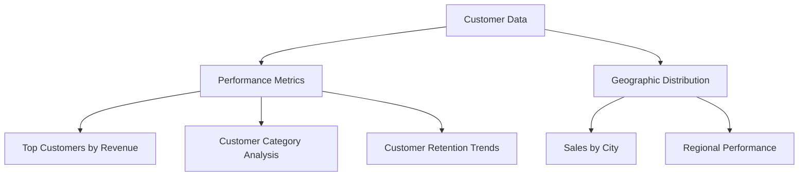
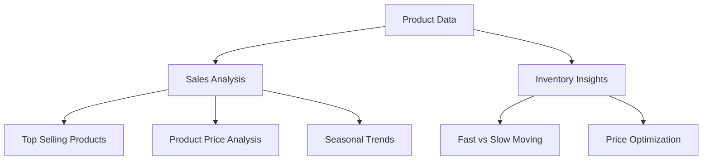
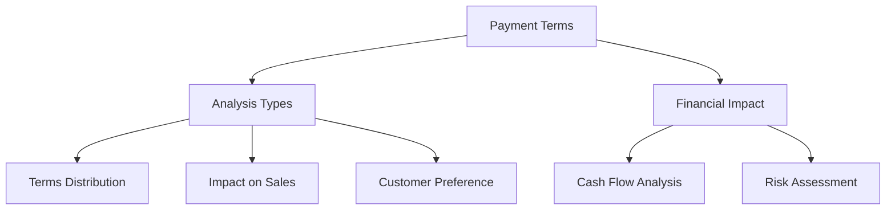
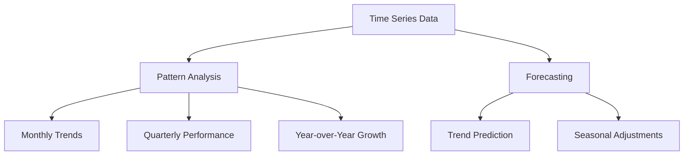
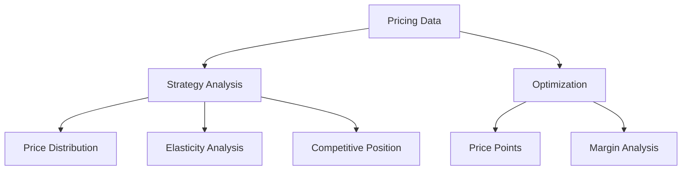
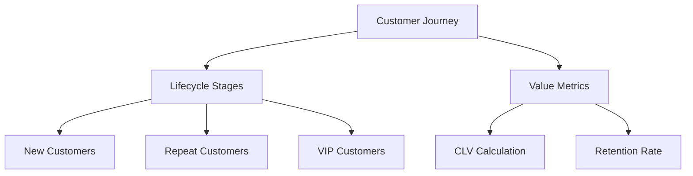
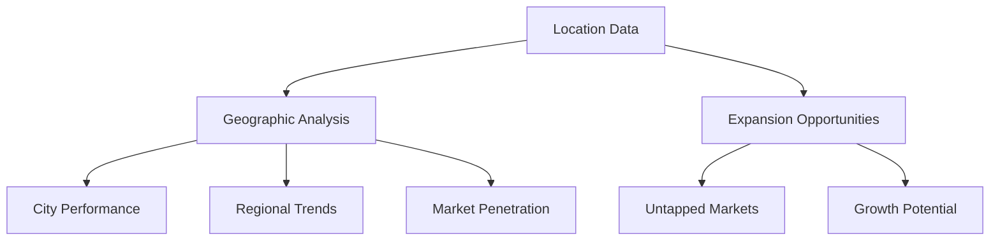
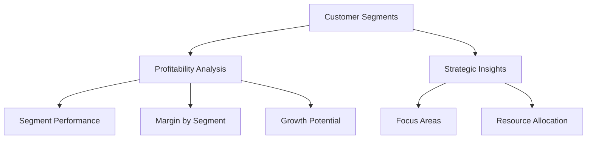

# Sales Insight Sections Design

## Overview

Based on analysis of the `Dummy_Data_Penjualan_2020-2024.csv` data, this document outlines new report sections that can provide valuable sales insights. The data contains rich information about sales transactions including customer details, product information, pricing, payment terms, and geographic data.

## Data Structure Analysis

The CSV contains the following key fields:
- **Customer Data**: KodePelanggan, NamaPelanggan, KategoriPelanggan, Lokasi
- **Product Data**: KodeBarang, NamaBarang
- **Transaction Data**: INV, Tanggal, Termin, Kuantitas, Satuan, Harga, Penjualan
- **Geographic Data**: City-based customer locations

## Data Sufficiency Assessment

### ✅ Sections yang DAPAT dibuat dengan data CSV yang ada:

#### 1. Customer Performance Analysis Section - **FEASIBLE**
- ✅ Data pelanggan lengkap (nama, kategori, lokasi)
- ✅ Data transaksi untuk menghitung total sales per customer
- ✅ Data tanggal untuk analisis retention
- ✅ Data kategori pelanggan (Distributor, Retail, Grosir)
- ✅ Data lokasi untuk analisis geografis

#### 2. Product Performance Insights Section - **FEASIBLE**
- ✅ Data produk (kode dan nama)
- ✅ Data penjualan per produk
- ✅ Data kuantitas dan harga
- ✅ Data waktu untuk trend analysis

#### 3. Payment Terms Impact Section - **FEASIBLE**
- ✅ Data termin pembayaran (N7, N15, N30)
- ✅ Data nilai transaksi untuk analisis impact
- ✅ Data customer category untuk preference analysis

#### 4. Seasonal Sales Patterns Section - **FEASIBLE**
- ✅ Data tanggal lengkap (2020-2024)
- ✅ Data penjualan harian
- ✅ Cukup data untuk analisis pattern musiman

#### 5. Geographic Sales Intelligence Section - **FEASIBLE**
- ✅ Data lokasi customer (Jakarta, Bandung, Surabaya, Medan, Semarang)
- ✅ Data sales per lokasi
- ✅ Distribusi customer per kota

### ⚠️ Sections yang TERBATAS dengan data CSV yang ada:

#### 6. Pricing Strategy Analytics Section - **LIMITED**
- ✅ Data harga produk tersedia
- ⚠️ **Missing**: Data kompetitor pricing
- ⚠️ **Missing**: Cost data untuk margin analysis
- ⚠️ **Missing**: Market price benchmarks
- **Recommendation**: Fokus hanya pada internal price distribution dan price elasticity

#### 7. Customer Lifecycle Value Section - **LIMITED**
- ✅ Data transaksi berulang per customer
- ✅ Data tanggal untuk menghitung frequency
- ⚠️ **Missing**: Customer acquisition cost
- ⚠️ **Missing**: Customer service costs
- ⚠️ **Missing**: Churn indicators selain frequency
- **Recommendation**: Fokus pada purchase pattern dan frequency analysis

#### 8. Customer Segment Profitability Section - **LIMITED**
- ✅ Data kategori customer
- ✅ Data sales per segment
- ⚠️ **Missing**: Cost data untuk menghitung profit margin
- ⚠️ **Missing**: Operational costs per segment
- **Recommendation**: Fokus pada revenue analysis instead of profit

### 🔄 Modifikasi yang Diperlukan untuk Section Terbatas:

#### Modified: Revenue Strategy Analytics (instead of Pricing Strategy)
- Fokus pada internal price performance
- Price distribution analysis
- Revenue optimization berdasarkan historical data
- Price elasticity simulation

#### Modified: Customer Value Analysis (instead of Lifecycle Value)
- Customer purchase frequency
- Average order value trends
- Customer loyalty scoring
- Purchase pattern analysis

#### Modified: Customer Segment Revenue Analysis (instead of Profitability)
- Revenue per segment
- Growth rate per segment
- Market share per segment
- Customer acquisition trends

### 📊 Data Quality Assessment:

#### Strengths:
- **Complete time series**: 5 tahun data (2020-2024)
- **Rich transaction details**: Harga, kuantitas, total penjualan
- **Customer segmentation**: 3 kategori jelas
- **Geographic coverage**: 5 kota utama
- **Product variety**: 5 produk utama
- **Payment terms variety**: 3 jenis termin

#### Limitations:
- **No cost data**: Tidak ada data COGS atau operational costs
- **No competitive data**: Tidak ada benchmark eksternal
- **Limited product attributes**: Hanya nama produk, tidak ada kategori detail
- **No customer demographics**: Hanya kategori bisnis, tidak ada profil detail
- **No channel data**: Semua sales tampaknya direct, tidak ada channel distribution

### 🎯 Recommended Implementation Priority:

**Phase 1 - High Feasibility (Implementasi Segera):**
1. Customer Performance Analysis
2. Product Performance Insights
3. Seasonal Sales Patterns
4. Geographic Sales Intelligence

**Phase 2 - Medium Feasibility (Perlu Adaptasi):**
5. Payment Terms Impact Analysis
6. Customer Value Analysis (modified)
7. Revenue Strategy Analytics (modified)

**Phase 3 - Future Enhancement (Perlu Data Tambahan):**
8. Customer Segment Profitability (when cost data available)
9. Competitive Analysis (when market data available)
10. Advanced Predictive Analytics (when more variables available)

## Proposed New Section Components

### 1. Customer Performance Analysis Section



#### Component: CustomerPerformanceSection.tsx

**Features:**
- Top customers by total sales value
- Customer category breakdown (Distributor, Retail, Grosir)
- Average order value by customer type
- Customer retention analysis
- Geographic performance visualization

**Data Processing:**
```typescript
interface CustomerAnalysisData {
  customerName: string;
  customerCategory: string;
  location: string;
  totalSales: number;
  orderCount: number;
  averageOrderValue: number;
  lastOrderDate: string;
}
```

### 2. Product Performance Insights Section



#### Component: ProductInsightsSection.tsx

**Features:**
- Product ranking by sales volume and revenue
- Price point analysis and optimization opportunities
- Product performance trends over time
- Inventory turnover analysis
- Product mix optimization recommendations

**Visualization:**
- Bubble chart showing price vs volume vs profit
- Heatmap of product performance by month
- Pareto chart for 80/20 analysis

### 3. Payment Terms Impact Section



#### Component: PaymentTermsSection.tsx

**Features:**
- Distribution of payment terms (N7, N15, N30)
- Impact of payment terms on order size
- Customer preference analysis by category
- Cash flow projection based on terms
- Risk analysis for extended payment terms

**Charts:**
- Stacked bar chart showing terms distribution
- Line chart showing average order value by terms
- Pie chart of customer preferences

### 4. Seasonal Sales Patterns Section



#### Component: SeasonalPatternsSection.tsx

**Features:**
- Monthly sales trend analysis
- Seasonal pattern identification
- Year-over-year growth comparison
- Holiday and event impact analysis
- Sales forecasting based on historical patterns

**Visualizations:**
- Multi-year line chart with seasonal highlights
- Heatmap calendar view of daily sales
- Waterfall chart showing monthly changes

### 5. Pricing Strategy Analytics Section



#### Component: PricingAnalyticsSection.tsx

**Features:**
- Price distribution analysis across products
- Price elasticity insights
- Optimal pricing recommendations
- Margin analysis by product and customer
- Competitive pricing positioning

**Interactive Elements:**
- Price slider simulation
- Dynamic margin calculator
- Price optimization suggestions

### 6. Customer Lifecycle Value Section



#### Component: CustomerLifecycleSection.tsx

**Features:**
- Customer lifecycle stage analysis
- Customer Lifetime Value (CLV) calculation
- Retention rate analysis
- Churn prediction indicators
- Customer upgrade path visualization

**Metrics:**
- Average customer lifespan
- Purchase frequency trends
- Revenue per customer progression
- Retention cohort analysis

### 7. Geographic Sales Intelligence Section



#### Component: GeographicIntelligenceSection.tsx

**Features:**
- Sales performance by city/region
- Market penetration analysis
- Geographic growth opportunities
- Regional customer behavior patterns
- Territory optimization recommendations

**Visualizations:**
- Interactive map with sales heatmap
- Bar chart of top performing cities
- Bubble map showing market potential

### 8. Customer Segment Profitability Section



#### Component: CustomerSegmentProfitabilitySection.tsx

**Features:**
- Profitability analysis by customer category
- Segment growth trends
- Resource allocation recommendations
- Customer acquisition cost by segment
- Lifetime value comparison across segments

## Implementation Guide

Implementing the 5 feasible sections following your existing patterns. Each section requires 4 main components:

### 1. Query Templates (src/lib/queryTemplates.ts)

Add the new queries to your existing queryTemplates object:

```typescript
// Add to queryTemplates object
customer_performance: [
  {
    id: "customer_analysis",
    query: `
      SELECT
        NamaPelanggan,
        KategoriPelanggan,
        Lokasi,
        SUM(Penjualan) as total_sales,
        COUNT(DISTINCT INV) as order_count,
        AVG(Penjualan) as avg_order_value,
        MAX(Tanggal) as last_order_date,
        COUNT(DISTINCT DATE(Tanggal)) as active_days
      FROM \`your_project.your_dataset.Dummy_Data_Penjualan_2020_2024\`
      WHERE DATE(Tanggal) >= DATE_SUB(CURRENT_DATE(), INTERVAL 12 MONTH)
      GROUP BY NamaPelanggan, KategoriPelanggan, Lokasi
      ORDER BY total_sales DESC
      LIMIT 100
    `,
  },
],

product_insights: [
  {
    id: "product_performance",
    query: `
      SELECT
        NamaBarang,
        SUM(Kuantitas) as total_quantity,
        SUM(Penjualan) as total_revenue,
        AVG(Harga) as avg_price,
        COUNT(DISTINCT KodePelanggan) as unique_customers,
        COUNT(DISTINCT INV) as order_count,
        MIN(Harga) as min_price,
        MAX(Harga) as max_price
      FROM \`your_project.your_dataset.Dummy_Data_Penjualan_2020_2024\`
      WHERE DATE(Tanggal) >= DATE_SUB(CURRENT_DATE(), INTERVAL 12 MONTH)
      GROUP BY NamaBarang
      ORDER BY total_revenue DESC
    `,
  },
],

seasonal_patterns: [
  {
    id: "monthly_trends",
    query: `
      SELECT
        FORMAT_DATE('%Y-%m', DATE(Tanggal)) AS month,
        EXTRACT(YEAR FROM DATE(Tanggal)) as year,
        EXTRACT(MONTH FROM DATE(Tanggal)) as month_num,
        SUM(Penjualan) as monthly_sales,
        COUNT(DISTINCT INV) as order_count,
        AVG(Penjualan) as avg_order_value,
        COUNT(DISTINCT KodePelanggan) as unique_customers
      FROM \`your_project.your_dataset.Dummy_Data_Penjualan_2020_2024\`
      WHERE DATE(Tanggal) >= DATE_SUB(CURRENT_DATE(), INTERVAL 24 MONTH)
      GROUP BY month, year, month_num
      ORDER BY year, month_num
    `,
  },
],

geographic_intelligence: [
  {
    id: "location_analysis",
    query: `
      SELECT
        Lokasi,
        COUNT(DISTINCT KodePelanggan) as customer_count,
        SUM(Penjualan) as total_sales,
        AVG(Penjualan) as avg_order_value,
        COUNT(DISTINCT INV) as order_count,
        COUNT(DISTINCT NamaBarang) as product_variety,
        -- Customer category breakdown per location
        COUNTIF(KategoriPelanggan = 'Distributor') as distributor_count,
        COUNTIF(KategoriPelanggan = 'Retail') as retail_count,
        COUNTIF(KategoriPelanggan = 'Grosir') as grosir_count
      FROM \`your_project.your_dataset.Dummy_Data_Penjualan_2020_2024\`
      WHERE DATE(Tanggal) >= DATE_SUB(CURRENT_DATE(), INTERVAL 12 MONTH)
      GROUP BY Lokasi
      ORDER BY total_sales DESC
    `,
  },
],

payment_terms: [
  {
    id: "payment_analysis",
    query: `
      SELECT
        Termin,
        KategoriPelanggan,
        COUNT(DISTINCT INV) as order_count,
        SUM(Penjualan) as total_sales,
        AVG(Penjualan) as avg_order_value,
        COUNT(DISTINCT KodePelanggan) as unique_customers,
        SUM(Kuantitas) as total_quantity
      FROM \`your_project.your_dataset.Dummy_Data_Penjualan_2020_2024\`
      WHERE DATE(Tanggal) >= DATE_SUB(CURRENT_DATE(), INTERVAL 12 MONTH)
      GROUP BY Termin, KategoriPelanggan
      ORDER BY total_sales DESC
    `,
  },
],
```

**Note:** Replace `your_project.your_dataset.Dummy_Data_Penjualan_2020_2024` with your actual BigQuery table reference.

### Additional Queries for Enhanced Analysis

```typescript
// Optional: Additional queries for deeper insights
customer_performance: [
  {
    id: "customer_analysis",
    query: `/* previous query */`,
  },
  {
    id: "customer_retention",
    query: `
      WITH customer_months AS (
        SELECT 
          KodePelanggan,
          NamaPelanggan,
          FORMAT_DATE('%Y-%m', DATE(Tanggal)) as month,
          SUM(Penjualan) as monthly_sales
        FROM \`your_project.your_dataset.Dummy_Data_Penjualan_2020_2024\`
        GROUP BY KodePelanggan, NamaPelanggan, month
      ),
      customer_frequency AS (
        SELECT 
          KodePelanggan,
          NamaPelanggan,
          COUNT(DISTINCT month) as active_months,
          SUM(monthly_sales) as total_sales
        FROM customer_months
        GROUP BY KodePelanggan, NamaPelanggan
      )
      SELECT 
        KodePelanggan,
        NamaPelanggan,
        active_months,
        total_sales,
        CASE 
          WHEN active_months >= 12 THEN 'High Retention'
          WHEN active_months >= 6 THEN 'Medium Retention'
          ELSE 'Low Retention'
        END as retention_category
      FROM customer_frequency
      ORDER BY total_sales DESC
    `,
  },
],

product_insights: [
  {
    id: "product_performance",
    query: `/* previous query */`,
  },
  {
    id: "product_trends",
    query: `
      SELECT
        NamaBarang,
        FORMAT_DATE('%Y-%m', DATE(Tanggal)) as month,
        SUM(Penjualan) as monthly_revenue,
        SUM(Kuantitas) as monthly_quantity,
        AVG(Harga) as avg_monthly_price
      FROM \`your_project.your_dataset.Dummy_Data_Penjualan_2020_2024\`
      WHERE DATE(Tanggal) >= DATE_SUB(CURRENT_DATE(), INTERVAL 12 MONTH)
      GROUP BY NamaBarang, month
      ORDER BY NamaBarang, month
    `,
  },
],
```

### 2. Section Processors (src/lib/processors/sectionProcessors/)

#### customer_performance.ts
```typescript
export default function processCustomerPerformance(results: any, meta: unknown) {
  const inputData = results.customer_analysis || [];
  
  // Process data for charts
  const topCustomers = inputData.slice(0, 10).map((item: any) => ({
    name: item.NamaPelanggan,
    category: item.KategoriPelanggan,
    location: item.Lokasi,
    totalSales: parseFloat(item.total_sales),
    orderCount: parseInt(item.order_count),
    avgOrderValue: parseFloat(item.avg_order_value),
    lastOrderDate: item.last_order_date,
  }));
  
  // Category breakdown
  const categoryData: Record<string, any> = {};
  inputData.forEach((item: any) => {
    const category = item.KategoriPelanggan;
    if (!categoryData[category]) {
      categoryData[category] = {
        count: 0,
        totalSales: 0,
        avgOrderValue: 0
      };
    }
    categoryData[category].count += 1;
    categoryData[category].totalSales += parseFloat(item.total_sales);
  });
  
  const categoryChart = Object.entries(categoryData).map(([category, data]: [string, any]) => ({
    category,
    count: data.count,
    totalSales: data.totalSales,
    avgSales: data.totalSales / data.count
  }));
  
  return {
    chartData: {
      topCustomers,
      categoryChart,
      totalCustomers: inputData.length,
      totalRevenue: inputData.reduce((sum: number, item: any) => sum + parseFloat(item.total_sales), 0)
    }
  };
}
```

#### product_insights.ts
```typescript
export default function processProductInsights(results: any, meta: unknown) {
  const inputData = results.product_performance || [];
  
  const products = inputData.map((item: any) => ({
    name: item.NamaBarang,
    totalQuantity: parseInt(item.total_quantity),
    totalRevenue: parseFloat(item.total_revenue),
    avgPrice: parseFloat(item.avg_price),
    uniqueCustomers: parseInt(item.unique_customers),
    orderCount: parseInt(item.order_count)
  }));
  
  return {
    chartData: {
      products: products.slice(0, 10),
      totalProducts: products.length,
      totalRevenue: products.reduce((sum, p) => sum + p.totalRevenue, 0)
    }
  };
}
```

#### seasonal_patterns.ts
```typescript
export default function processSeasonalPatterns(results: any, meta: unknown) {
  const inputData = results.monthly_trends || [];
  
  const monthMap: Record<string, string> = {
    "01": "Jan", "02": "Feb", "03": "Mar", "04": "Apr",
    "05": "May", "06": "Jun", "07": "Jul", "08": "Aug",
    "09": "Sep", "10": "Oct", "11": "Nov", "12": "Dec"
  };
  
  const chartData = inputData.map((item: any) => {
    const [year, month] = item.month.split('-');
    const monthName = monthMap[month];
    return {
      month: `${monthName}-${year}`,
      sales: parseFloat(item.monthly_sales),
      orderCount: parseInt(item.order_count),
      avgOrderValue: parseFloat(item.avg_order_value)
    };
  });
  
  return { chartData };
}
```

#### geographic_intelligence.ts
```typescript
export default function processGeographicIntelligence(results: any, meta: unknown) {
  const inputData = results.location_analysis || [];
  
  const locationData = inputData.map((item: any) => ({
    location: item.Lokasi,
    customerCount: parseInt(item.customer_count),
    totalSales: parseFloat(item.total_sales),
    avgOrderValue: parseFloat(item.avg_order_value),
    orderCount: parseInt(item.order_count)
  }));
  
  return {
    chartData: {
      locations: locationData,
      totalLocations: locationData.length
    }
  };
}
```

#### payment_terms.ts
```typescript
export default function processPaymentTerms(results: any, meta: unknown) {
  const inputData = results.payment_analysis || [];
  
  const termsData: Record<string, any> = {};
  
  inputData.forEach((item: any) => {
    const term = item.Termin;
    if (!termsData[term]) {
      termsData[term] = {
        orderCount: 0,
        totalSales: 0,
        categories: {}
      };
    }
    
    termsData[term].orderCount += parseInt(item.order_count);
    termsData[term].totalSales += parseFloat(item.total_sales);
    
    const category = item.KategoriPelanggan;
    if (!termsData[term].categories[category]) {
      termsData[term].categories[category] = {
        orderCount: 0,
        totalSales: 0
      };
    }
    termsData[term].categories[category].orderCount += parseInt(item.order_count);
    termsData[term].categories[category].totalSales += parseFloat(item.total_sales);
  });
  
  const chartData = Object.entries(termsData).map(([term, data]: [string, any]) => ({
    term,
    orderCount: data.orderCount,
    totalSales: data.totalSales,
    avgOrderValue: data.totalSales / data.orderCount,
    categories: Object.entries(data.categories).map(([cat, catData]: [string, any]) => ({
      category: cat,
      orderCount: catData.orderCount,
      totalSales: catData.totalSales
    }))
  }));
  
  return { chartData };
}
```

### 3. Section Components (src/components/report/sections/)

#### CustomerPerformanceSection.tsx
```typescript
import React from "react";
import BaseSectionLayout from "../shared/BaseSectionLayout";
import ActionTitle from "../shared/ActionTitle";
import { InsightManager } from "../shared";
import ChartComponent from "../ChartComponent";
import { QueryItem } from "../QueryEditor";

interface CustomerPerformanceProps {
  section: {
    id: string;
    title: string;
    content: {
      text: string;
      actionTitle?: string;
      subheadline?: string;
      chartData?: any;
      insights?: Array<{ title: string; body: string }>;
      queries?: QueryItem[];
    };
  };
  onUpdate: (updates: any) => void;
  isEditable?: boolean;
}

const CustomerPerformanceSection: React.FC<CustomerPerformanceProps> = ({
  section,
  onUpdate,
  isEditable = false,
}) => {
  const queries = section.content.queries || [];
  const insights = section.content.insights || [];
  const chartData = section.content.chartData;

  const handleQueryEditorChange = (newQueries: QueryItem[]) => {
    onUpdate({ content: { ...section.content, queries: newQueries } });
  };

  const handleActionTitleChange = (newTitle: string) => {
    onUpdate({ content: { ...section.content, actionTitle: newTitle } });
  };

  const handleSubheadlineChange = (newSubheadline: string) => {
    onUpdate({ content: { ...section.content, subheadline: newSubheadline } });
  };

  const handleAddInsight = () => {
    const newInsights = [...insights, { title: "", body: "" }];
    onUpdate({ content: { ...section.content, insights: newInsights } });
  };

  const handleEditInsight = (idx: number, field: "title" | "body", value: string) => {
    const newInsights = insights.map((ins, i) =>
      i === idx ? { ...ins, [field]: value } : ins
    );
    onUpdate({ content: { ...section.content, insights: newInsights } });
  };

  const handleDeleteInsight = (idx: number) => {
    const newInsights = insights.filter((_, i) => i !== idx);
    onUpdate({ content: { ...section.content, insights: newInsights } });
  };

  const customerData = chartData?.topCustomers || [];
  const categoryData = chartData?.categoryChart || [];

  return (
    <BaseSectionLayout
      queries={queries}
      isEditable={isEditable}
      onQueryChange={handleQueryEditorChange}
      channels={[]}
    >
      <div className="p-8">
        <div className="mb-8 group">
          <ActionTitle
            title={section.content.actionTitle || "Customer Performance Analysis"}
            subheadline={section.content.subheadline || "Comprehensive analysis of customer behavior and value"}
            isEditable={isEditable}
            onEditTitle={handleActionTitleChange}
            onEditSubheadline={handleSubheadlineChange}
          />
        </div>

        <div className="flex flex-col gap-8 lg:grid lg:grid-cols-5">
          {/* Chart Section */}
          <div className="overflow-hidden lg:col-span-3">
            <ChartComponent
              config={{
                type: "bar",
                data: customerData.slice(0, 10).map((customer: any) => ({
                  name: customer.name,
                  value: customer.totalSales / 1000000, // Convert to millions
                  category: customer.category
                })),
                title: "Top Customers by Revenue",
                width: 800,
                height: 400,
                xKey: "name",
                yKey: "value",
                colors: ["#3b82f6"],
                showGrid: true,
                showTooltip: true,
                showLegend: false,
              }}
              isEditable={false}
            />
          </div>

          {/* Insights Section */}
          <div className="lg:col-span-2">
            <InsightManager
              insights={insights}
              isEditable={isEditable}
              onAddInsight={handleAddInsight}
              onEditInsight={handleEditInsight}
              onDeleteInsight={handleDeleteInsight}
            />
          </div>
        </div>
      </div>
    </BaseSectionLayout>
  );
};

export default CustomerPerformanceSection;
```

### 4. Update SectionTemplates.tsx

Add the new sections to the templates array:

```typescript
// Add these to the templates array in SectionTemplates.tsx
{
  type: "customer_performance",
  title: "Customer Performance Analysis",
  description: "Comprehensive analysis of customer behavior and value",
  icon: DollarSign,
  color: "blue",
},
{
  type: "product_insights",
  title: "Product Performance Insights",
  description: "Deep dive into product sales patterns and optimization",
  icon: BarChart3,
  color: "green",
},
{
  type: "seasonal_patterns",
  title: "Seasonal Sales Patterns",
  description: "Seasonal trends and forecasting insights",
  icon: BarChart3,
  color: "orange",
},
{
  type: "geographic_intelligence",
  title: "Geographic Sales Intelligence",
  description: "Location-based sales analysis and market opportunities",
  icon: BarChart3,
  color: "red",
},
{
  type: "payment_terms",
  title: "Payment Terms Impact",
  description: "Analysis of payment terms effect on sales and cash flow",
  icon: DollarSign,
  color: "purple",
},
```

### 5. Register Components in ReportSection.tsx

Add imports and component mappings in your main ReportSection component:

```typescript
// Add imports
import CustomerPerformanceSection from "./sections/CustomerPerformanceSection";
import ProductInsightsSection from "./sections/ProductInsightsSection";
import SeasonalPatternsSection from "./sections/SeasonalPatternsSection";
import GeographicIntelligenceSection from "./sections/GeographicIntelligenceSection";
import PaymentTermsSection from "./sections/PaymentTermsSection";

// Add to section type mapping
case "customer_performance":
  return <CustomerPerformanceSection {...props} />;
case "product_insights":
  return <ProductInsightsSection {...props} />;
case "seasonal_patterns":
  return <SeasonalPatternsSection {...props} />;
case "geographic_intelligence":
  return <GeographicIntelligenceSection {...props} />;
case "payment_terms":
  return <PaymentTermsSection {...props} />;
```

### 6. Update Processor Index

Add exports to `src/lib/processors/sectionProcessors/index.ts`:

```typescript
export { default as customer_performance } from './customer_performance';
export { default as product_insights } from './product_insights';
export { default as seasonal_patterns } from './seasonal_patterns';
export { default as geographic_intelligence } from './geographic_intelligence';
export { default as payment_terms } from './payment_terms';
```

This implementation follows your existing patterns exactly:
- Uses `BaseSectionLayout` with `queries`, `isEditable`, `onQueryChange`
- Implements `ActionTitle` with edit capabilities
- Uses `InsightManager` for insights section
- Follows the same processor pattern with `export default function`
- Uses consistent chart configuration with `ChartComponent`
- Maintains the same TypeScript interfaces and prop patterns


