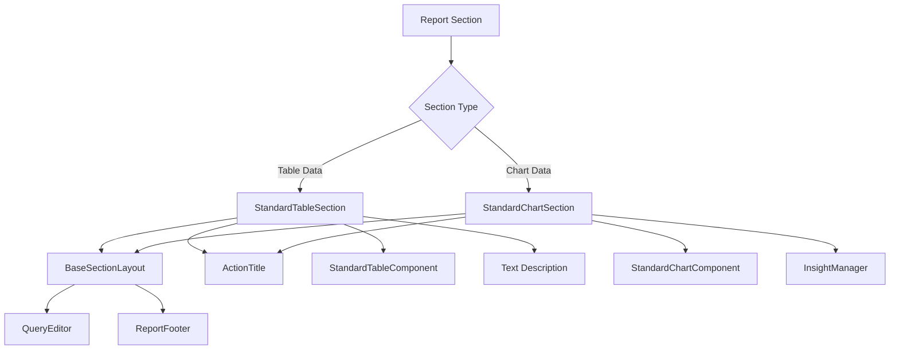
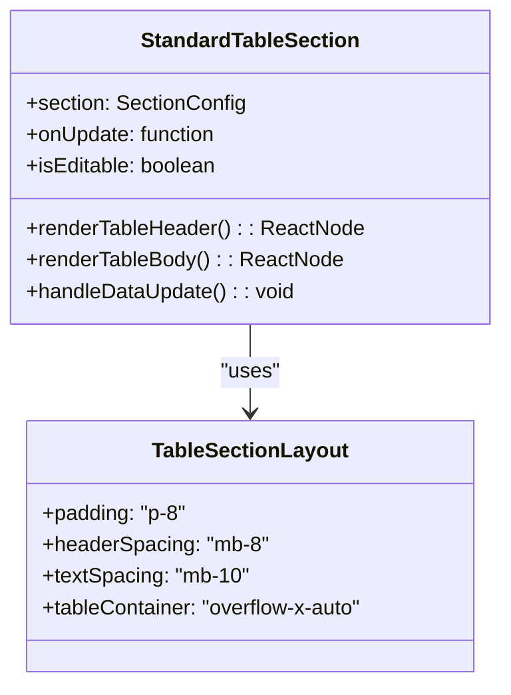
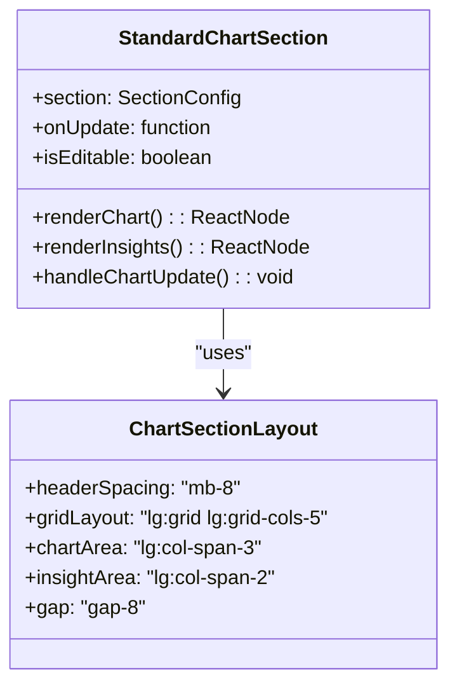
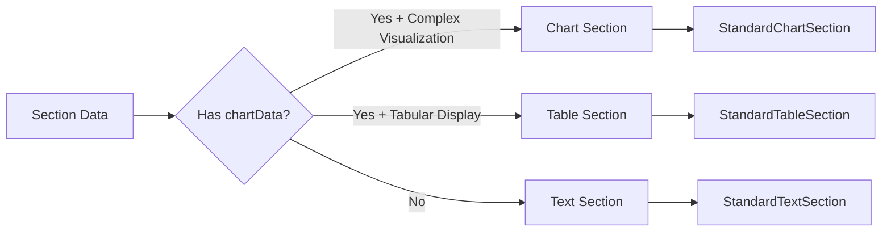
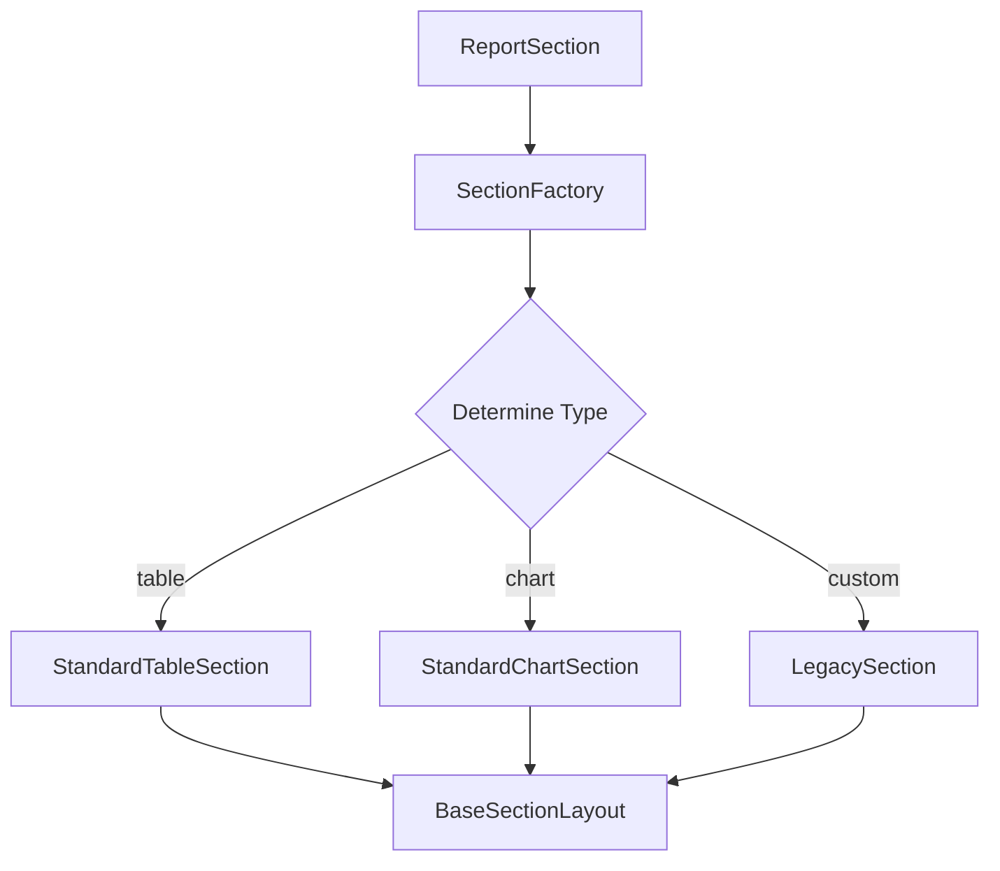

# Report Section Layout Standardization Design

## Overview

This design document outlines the standardization of all report section layouts to ensure visual consistency and improved user experience across the report-builder application. The current system has inconsistent layouts between different section types, leading to a fragmented user interface. This standardization will create two distinct, consistent layout patterns: **Table Sections** and **Chart Sections**.

## Architecture

### Current State Analysis

The current implementation shows inconsistent layout patterns across different section types:

- **BrandPerformancePlatformSection**: Uses table-focused layout with custom styling
- **TopBrandChannelSection**: Uses chart-focused layout with InsightManager integration
- **Other sections**: Mix of various layout approaches without consistent patterns

### Target Architecture



## Component Architecture

### 1. StandardTableSection Layout

**Purpose**: Standardized layout for sections displaying tabular data
**Example**: BrandPerformancePlatformSection

#### Layout Structure


#### Visual Layout Pattern
- **Header Section**: ActionTitle with consistent spacing (mb-8)
- **Description Area**: Editable text with standardized styling (mb-10)
- **Table Container**: Responsive table with consistent styling
- **Standard Padding**: Consistent p-8 padding throughout

### 2. StandardChartSection Layout

**Purpose**: Standardized layout for sections displaying chart visualizations
**Example**: TopBrandChannelSection

#### Layout Structure


#### Visual Layout Pattern
- **Header Section**: ActionTitle with consistent spacing (mb-8)
- **Two-Column Grid**: Chart (60%) and Insights (40%) on desktop
- **Responsive Design**: Stack vertically on mobile devices
- **Standard Spacing**: Consistent gap-8 between elements

## Styling Strategy

### Design Tokens

#### Spacing Standards
```typescript
const SECTION_SPACING = {
  container: 'p-8',           // Main container padding
  headerBottom: 'mb-8',       // Space after ActionTitle
  textBottom: 'mb-10',        // Space after description text
  elementGap: 'gap-8',        // Gap between major elements
  gridCols: 'lg:grid-cols-5', // Standard grid ratio (3:2)
} as const;
```

#### Table Styling Standards
```typescript
const TABLE_STYLES = {
  container: 'overflow-x-auto',
  table: 'min-w-full overflow-hidden text-sm text-left text-gray-700 bg-white border shadow-sm rounded-2xl',
  header: 'text-xs text-gray-600 uppercase bg-gray-100',
  headerCell: 'px-6 py-3',
  bodyRow: 'transition border-t border-gray-200 hover:bg-gray-50',
  bodyCell: 'px-6 py-4',
  primaryCell: 'px-6 py-4 font-medium text-gray-900',
} as const;
```

#### Chart Container Standards
```typescript
const CHART_STYLES = {
  container: 'overflow-hidden lg:col-span-3',
  chartWrapper: 'relative p-4 border border-gray-100 shadow-sm bg-gradient-to-br from-gray-50/50 to-white rounded-2xl',
  height: 'h-80',
  insightContainer: 'lg:col-span-2',
} as const;
```

## Data Flow and Integration

### Section Type Detection



### Data Structure Standards

#### Table Section Interface
```typescript
interface TableSectionData {
  actionTitle: string;
  subheadline?: string;
  text?: string;
  tableData: Record<string, string | number>[];
  tableConfig: {
    columns: ColumnConfig[];
    sortable?: boolean;
    filterable?: boolean;
  };
}
```

#### Chart Section Interface
```typescript
interface ChartSectionData {
  actionTitle: string;
  subheadline?: string;
  chartData: Record<string, string | number>[];
  chartConfig: ChartConfig;
  insights: InsightItem[];
  interactiveElements?: InteractiveConfig;
}
```

## Component Implementation Strategy

### Phase 1: Create Standard Layout Components

#### 1.1 StandardTableSection Component
```typescript
interface StandardTableSectionProps {
  section: TableSectionConfig;
  onUpdate: (updates: Partial<TableSectionConfig>) => void;
  isEditable?: boolean;
}
```

**Key Features**:
- Consistent ActionTitle integration
- Standardized table styling
- Responsive design patterns
- Editable text description area

#### 1.2 StandardChartSection Component
```typescript
interface StandardChartSectionProps {
  section: ChartSectionConfig;
  onUpdate: (updates: Partial<ChartSectionConfig>) => void;
  isEditable?: boolean;
}
```

**Key Features**:
- Two-column responsive grid layout
- Integrated InsightManager
- Consistent chart container styling
- Standardized interaction patterns

### Phase 2: Migration Strategy

#### 2.1 Section Type Mapping
```typescript
const SECTION_TYPE_MAPPING = {
  // Table Sections
  'brand_performance_platform': 'table',
  'payment_terms': 'table',
  'platform_sales_value': 'table',
  'store_sales_value': 'table',
  
  // Chart Sections
  'top_brand_channel': 'chart',
  'sales_overview': 'chart',
  'top_categories': 'chart',
  'geographic_intelligence': 'chart',
  'seasonal_patterns': 'chart',
} as const;
```

#### 2.2 Component Factory Pattern


## Testing Strategy

### Visual Regression Testing
- **Before/After Screenshots**: Compare layouts for each section type
- **Responsive Testing**: Verify consistency across different screen sizes
- **Interactive Testing**: Ensure all interactive elements work consistently

### Unit Testing
```typescript
describe('StandardTableSection', () => {
  it('should render with consistent spacing', () => {});
  it('should handle editable state correctly', () => {});
  it('should maintain table styling standards', () => {});
});

describe('StandardChartSection', () => {
  it('should render two-column layout on desktop', () => {});
  it('should stack columns on mobile', () => {});
  it('should integrate InsightManager correctly', () => {});
});
```

## Implementation Plan

### Phase 1: Foundation (Week 1-2)
1. Create `StandardTableSection` component
2. Create `StandardChartSection` component  
3. Define styling constants and design tokens
4. Update shared component dependencies

### Phase 2: Migration (Week 3-4)
1. Migrate table-based sections to `StandardTableSection`
2. Migrate chart-based sections to `StandardChartSection`
3. Update section factory logic
4. Perform visual regression testing

### Phase 3: Refinement (Week 5)
1. Address edge cases and special requirements
2. Performance optimization
3. Accessibility improvements
4. Documentation updates

## Benefits

### User Experience
- **Consistency**: Uniform look and feel across all report sections
- **Predictability**: Users know what to expect from each section type
- **Accessibility**: Standardized patterns improve screen reader compatibility

### Developer Experience
- **Maintainability**: Single source of truth for layout patterns
- **Productivity**: Faster development of new sections
- **Quality**: Reduced CSS duplication and styling inconsistencies

### Performance
- **Bundle Size**: Reduced CSS duplication
- **Runtime**: Consistent component structure enables better optimization
- **Caching**: Shared styling improves browser caching efficiency